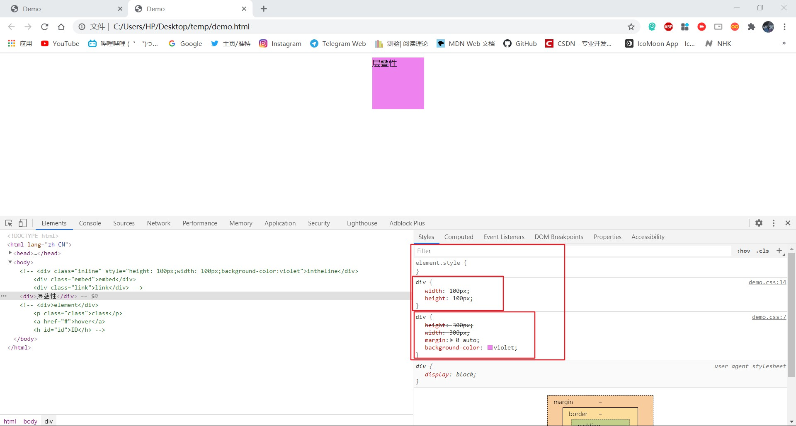

<!--  -->
### Ⅰ.CSS书写样式
**1. 行内式**

<!--  -->
**2. 内嵌式**

<!--  -->
**3. 外链式**

<!--  -->

---

<!--  -->

---
<!--more-->
**4. 属性书写**
1. 属性书写以键值对形式出现，即属性：属性值
2. 行内式属性优先级高于另外两种书写形式

### Ⅱ.CSS的三大特性
1. 层叠性：代码自上而下，后书写的样式会覆盖之前写的同选择器中同属性名的属性值

<!--  -->

<!--  -->
其中width(宽度)和height(高度)就是被覆盖的属性
2. 继承性：未标注的属性值会默认继承父元素的属性

<!--  -->

<!--  -->
其中width(宽度)被子元素继承，而height(高度)就是自身的属性
3. 优先级：css选择中不同的选择器是有不同的权重的，权重分为四个等级[0，0，0，0]他们被[ , ]逗号分隔每个位置的权重只能在自己位置上叠加但是不存在进位，从左往右权重等级依次递减，高权重等级绝对优先于低权重等级，无论权重数值，例如[1，0，0，0]优先级高于[0，1，1，1]
ps：继承的权重是[0，0，0，0]，行内样式style的权重是[1，0，0，0]

### Ⅲ.CSS的选择器
*普通选择器*
1. 通配符选择器——权重 **[0，0，0，0]**
        *(星号) {
            属性名：属性值；
        }

<!--  -->
2. 元素选择器——权重 **[0，0，0，1]**
        div (元素名) {
            属性名：属性值；
        }

<!--  -->
3. 类选择器——权重 **[0，0，1，0]**
        .class (类名) {
            属性名：属性值；
        }

<!--  -->
4. 伪类选择器——权重 **[0，0，1，0]**
        :hover (和其它选择器搭配使用，两者中间没有空格) {
            属性名：属性值；
        }

<!--  -->
5. id选择器——权重 **[0，1，0，0]**
        #id (id名) {
            属性名：属性值；
        }

<!--  -->
6. !important——权重 **无限大(提升属性权重)**
        选择器 {
            属性名：属性值 !important；(提升属性权重)
        }

<!--  -->
根据层叠性.class中height：1300px应该覆盖掉上一个.class中的属性，但是由于!important在，权重为无限大，于是不会被覆盖
---

<!--  -->

---

*复合选择器*

---

<!--  -->
---

1. 后代选择器

<!--  -->
**选择器每次在后代中选择一个，每个选择器之间用空格隔开**

<!--  -->
*如图通过后代选择器选择.son一项，将其颜色改为了紫色*
2. 子元素选择器

<!--  -->
**两选择器通过[>]连接，只选择次一级元素**

<!--  -->
*.grandpa的次一级子元素有二.dad和.sis，则选中后只将二者变成紫色*
3. 交集选择器

<!--  -->

<!--  -->
**交集选择器必须指定元素名，通过选择元素名的类(.bor)或者id(#bor)来指定选择器**

<!--  -->
*只有div和.bor(div和#bor)同时满足时才会修改选择器中的属性*
4. 并集选择器

<!--  -->
**通过[ , ]逗号分开的两个或多个选择器会被一起选中赋予相同的属性**

<!--  -->
*通过并集选择器选中了.son和.sis就被赋予了相同的属性和值*

### Ⅳ.CSS的显示模式
**1. 块级元素（block）**
- 1. 独自占据一行
- 2. 可以设置宽（width）高（height）
- 3. 默认宽度为继承宽度
- 4. 内部可以放置block、inline-block、inline
- 5. 文字类块级盒子（如p、h、dt）内不再放置块级元素

**2. 行内元素inline**
- 1. 一行内可以显示多个元素
- 2. 宽（width）高（height）设置均无法识别
- 3. 宽度即为自身的内容
- 4. 只能容纳单纯的文字或者其他行内元素
- 5. 不识别上下的内外边距

**3. 行内块元素（inline-block）**
- 1. 可以在一行内放置多个元素，但每个元素之间存在空隙
- 2. 可以设置宽（width）和高（height）
- 3. 默认宽度为自身内容宽度
- 4. 可以识别上下左右的内外边距

**4. display**
- 1. 该属性可以调整元素的显示方式
- 2. display：block——转换成块级元素
- 3. display：inline——转换成行内元素
- 4. display：inline-block——转换成行内级元素
- 5. display：none——可以隐藏元素的显示
### Ⅴ.CSS网页布局
**盒子模型**

<!--  -->
1. 外边距(margin)
   - i.可以通过margin-（top、right、bottom、left）分别设置也可以一起设置
      - 设置时注意书写[一个属性值]时表示为上下左右外边距都是该属性值
      - 设置时注意书写[两个属性值]时第一个属性值表示上下，第二个属性值表示左右
      - 设置时注意书写[三个属性值]时第一个属性值表示上，第二个属性值表示左右，第三个属性值表示下
      - 设置时注意书写[四个属性值]时第一个表示上，第二个表示右，第三个表示下，第四个表示左
   - ii.可以通过margin：0 auto的方式实现盒子的水平居中显示（前提为元素盒子必须有宽度）
   - iii.上下排列的盒子会出现bug（即上盒子有下外边距，下盒子有上外边距时只会显示外边距大的数值），因此设置上下外边距时上下相邻盒子只设置一个外边距
2. 边框(border)
    - i.边框粗细（width）样式（style）颜色（color）
    - ii. 合并边框时可以使用border-collapse：collapse（合并相邻的边框）
3. 内边距(padding)
   - i.可以通过padding-（top、right、bottom、left）分别设置也可以一起设置
      - 设置时注意书写[一个属性值]时表示为上下左右外边距都是该属性值
      - 设置时注意书写[两个属性值]时第一个属性值表示上下，第二个属性值表示左右
      - 设置时注意书写[三个属性值]时第一个属性值表示上，第二个属性值表示左右，第三个属性值表示下
      - 设置时注意书写[四个属性值]时第一个表示上，第二个表示右，第三个表示下，第四个表示左
    - ii.盒子自身具备宽（width）高（height）属性时padding会撑开盒子
4. 内容(content)
    - 盒子的大小 = 内容大小 + 内边距 + 边框