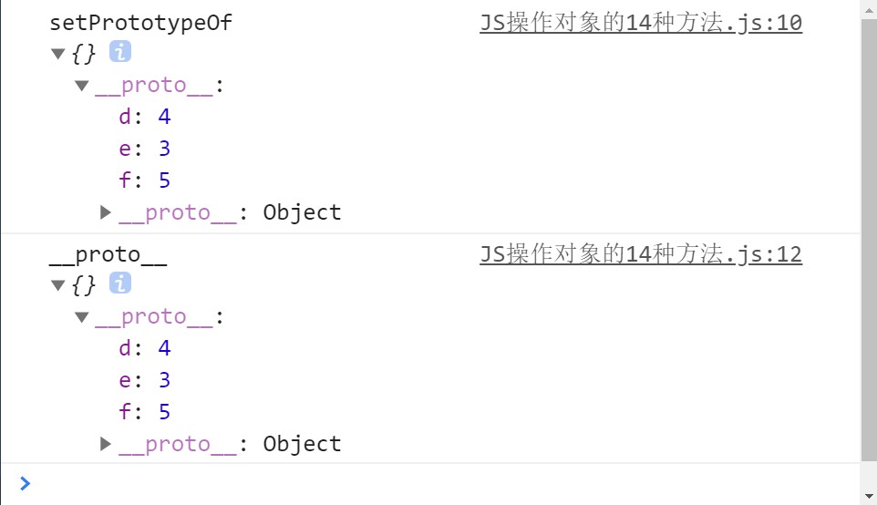
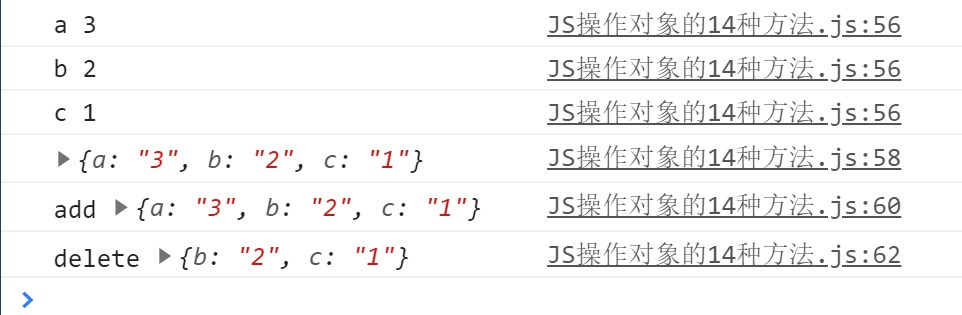

## 前言

**ECMAScript**委员会对对象操作有**14**中方法（直接操作对象，跟对象操作有关方法）

**JS 存在许多关键字形的指令，而许多底层方法都是函数式的，更容易读懂，也更容易维护**

<!--more-->

### 1.获取原型 [[GetPrototypeOf]]

```js
// 语法层面 -- Object.getPrototypeOf(obj)
var obj = {}
let proto = Object.getPrototypeOf(obj) // 底层API
console.log('proto', proto)
console.log('obj.__proto__', obj.__proto__) // 实例对象的原型容器
console.log('Object.prototype', Object.prototype) // 构造函数的原型属性
```



<!--  -->

### 2.设置原型 [[SetPrototypeOf]]

```js
var obj = {}
Object.setPrototypeOf(obj, { e: 3, d: 4 }) // 函数式(易读)
console.log('setPrototypeOf', obj)
obj.__proto__ = { e: 3, d: 4, f: 5 } // 赋值式
console.log('__proto__', obj)
```



<!--  -->

### 3.获取对象的可扩展性 [[IsExtensible]]

```js
var obj = {}
var extensible = Object.isExtensible(obj)
console.log('isExtensible', extensible) // 可扩展

Object.freeze(obj) // 对象冻结 - 不能修改，不可删除，不可写入，可读(枚举)
var extensible = Object.isExtensible(obj)
console.log('isExtensible', 'freeze', extensible) // 不可扩展

Object.seal(obj) // 对象封闭 - 不能修改，不可删除，可写入，可读(枚举)
var extensible = Object.isExtensible(obj)
console.log('isExtensible', 'seal', extensible) // 不可扩展
```



<!--  -->

### 4.获取自有属性 [[GetOwnProperty]]

```js
var obj = { own: 'property' }
Object.setPrototypeOf(obj, { d: 4, e: 5, f: 6 })
console.log(obj) // 只能是自有属性
console.log(Object.getOwnPropertyNames(obj)) // 获取自有属性名
console.log(Object.getOwnPropertyDescriptor(obj, 'own')) // 获取指定自有属性的描述符
console.log(Object.getOwnProperty(obj)) // 没有单独方法
```



<!--  -->

### 5.禁止扩展对象 [[PreventExtensions]]

```js
var obj = { a: '3', b: '2', c: '1' }
Object.preventExtensions(obj)
for (const k in obj) {
  console.log(k, obj[k])
}
console.log(obj) // 可读(枚举)
obj.d = 0
console.log('add', obj) // 不可添加(写入)
delete obj.a
console.log('delete', obj) // 可删除
```



<!--  -->

### 6.拦截对象操作 [[DefineOwnProperty]]

> 对象属性存在如下描述符：
>
> - `configurable` -- 是否可配置
> - `enumerable` -- 是否可枚举
> - `value` -- 属性值
> - `writable` -- 是否可写

```js
var obj = {}
Object.defineProperty(obj, 'A', {
  //defineProperty(要拦截的对象,属性名称,{描述器})
  value: 1,
})
console.log('src', obj)
obj.B = 2
console.log('add', obj) // 允许新加属性

obj.A = 3
console.log('change', obj) // 默认writable 为 false 不允许-改写-属性A

delete obj.A
console.log('delete', obj) // 默认configurable 为 false 不允许-删除-属性A

// 默认enumerable 为 false 不许-枚举-属性A
for (const k in obj) {
  console.log(k, obj[k])
}
```



<!--  -->

```js
Object.defineProperties(obj, {
  // defineProperties可以采用对象统一设置
  a: {
    configurable: true,
    enumerable: true,
    value: 1,
    writable: true,
  },
  b: {
    configurable: true,
    enumerable: true,
    value: 2,
    writable: false,
  },
})
```

```js
var _default = 0
Object.defineProperty(obj, 'a', {
  get() {
    //defineProperty 存在get方法
    return console.log(`拦截了a的获取==>取得值${_default}`)
  },
  set(value) {
    //defineProperty 存在set方法
    _default = value
    return console.log(`拦截了a的设置==>设置为${value}`)
  },
})
// [set,get] 和 [value,writable] 互斥，两组里任意一个属性和另一组内任意属性同时出现会报错
obj.a
obj.a = 2
```



<!--  -->

### 7.判断是否是自有属性 [[HasProperty]]

```js
var obj = { a: 1 }
Object.setPrototypeOf(obj, { b: 2 })
console.log(obj)
console.log('hasOwnProperty', 'a', obj.hasOwnProperty('a'))
console.log('hasOwnProperty', 'b', obj.hasOwnProperty('b'))
```



<!--  -->

### 8.[[GET]]

```js
var obj = { a: 1, e: 7 }
console.log('c in obj', 'c' in obj) // get机制一般用于判断属性(自有属性、原型属性都包含)是否在对象中
console.log('e in obj', 'e' in obj)
console.log('obj.a', obj.a) // 基于get机制可实现了对象的点取值等
```



<!--  -->

### 9.[[SET]]

```js
var obj = {}
obj.a = 3
obj.e = 4
console.log(obj)
```



<!--  -->

### 10.[[Delete]]

```js
var obj = { a: 3 }
console.log('src', obj)
delete obj.a
console.log('delete', obj)
```



<!--  -->

### 11.[[Enumerate]]

```js
// 实现出来的功能
var obj = { a: 1, b: 2, c: 3 }
for (let k in obj) {
  console.log(k, obj[k])
}
```



<!--  -->

### 12.自有属性键集合 [[OwnPropertyKeys]]

```js
var obj = { a: 1, b: 2 }
Object.setPrototypeOf(obj, { c: 3 })
console.log('src', obj)
console.log('OwnPropertyKeys', Object.keys(obj))
```



<!--  -->

### 13.调用函数

```js
function test() {}
test() // 引用值的调用
var obj = {}
obj.test = function () {}
obj.test()
```

### 14.实例化对象

```js
function Test() {}
new Test() // 实例化对象的操作
```
