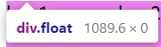
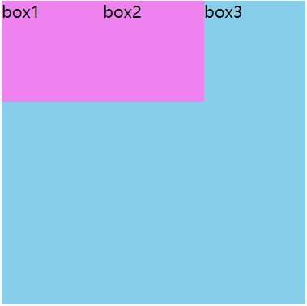
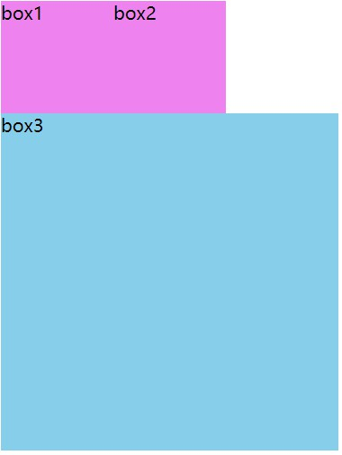
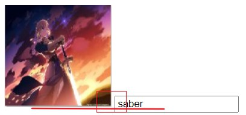
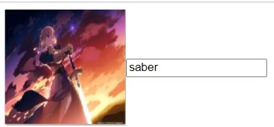
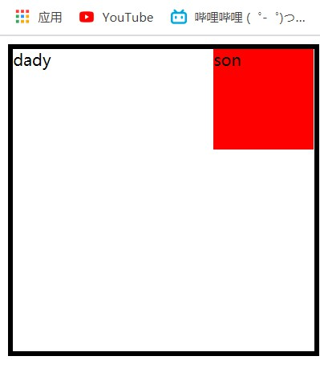

# 1.亿些 class 的命名（目前学习中常会用到的一些）

- ## 布局

  - ### header---网页头部

  - ### shortcut---快捷导航（网页头部搜索栏）

  - ### banner---网页广告区域（轮播图…）

  - ### nav---网页导航区域

  - ### aside---侧边栏

  - ### main---网页主要内容

  - ### footer---网页底部

  <!-- more -->

- ## 功能

  - ### logo---网页的徽标（一般用 h1 包括）

  - ### login---登录

  - ### register---注册

  - ### hot---热搜

  - ### news---新闻

  - ### icon---小图标

  - ### search---搜索

  - ### service---服务

  - ### btn---按钮

# 2.浮动带来的亿些负面影响

- > 浮动元素的父元素没有设置确定的高度的话，
  >
  > 那么子元素浮动后是不会撑开父盒子的，
  >
  > 如果不清除浮动父盒子是没有高度的，
  >
  > 其后的标准流盒子会紧贴在 0 高度的父盒子之下。
  >
  > ps：浮动元素是不会遮盖文字的

  

  <!--  -->

  

  <!--  -->

- ## 清除浮动

  - ### 1.清除浮动就是清除浮动带来的弊端

  - ### 2.原理：

    > 在**父元素**中添加一个**块级**元素来闭合浮动
    >
    > 语法：选择器{clear：both；}（一般是 both---同时清除左右两侧浮动的影响）

  - ### 3.方法

    > 1. 添加额外标签

    ```css
    /*
    给父元素内最后一个浮动元素的后面添加一个块级元素
    在那个块级元素css样式上添加clear属性和both属性值
    */
    ```

    > 2. 父元素添加 overflow：hidden；---通过触发浏览器**块级格式化上下文**机制清除浮动

    > 3. 伪元素法

    ```css
    .clearfix:after {
      content: '';
      display: block;
      height: 0;
      clear: both;
      visibility: hidden;
    }
    ```

    > 4. 双伪元素法

    ```css
    .clearfix:before,
    .clearfix:after {
      content: '';
      display: table;
    }
    .clearfix:after {
      clear: both;
    }
    ```

    

    <!--  -->

# 3.亿些小 tips

- ### 1. chrome 中，浏览默认字体大小 16px，最小字体 12px，可以通过设置更改默认的字体和最小字体（存在比例缩放时字体最小固定 12px 影响布局的情况可以更改设置），整 0px 时字体消失，负值时 CSS 样式失效

- ### 2.行内块元素（如 img，input）

  ```html
  
  <input type="text" />
  <!--
  如此换行排列，换行也会合并成一个空格，就导致了行内块元素之间会存在间隙;
  并且在行内块元素和文字对齐时候是默认基线对齐的，所以会出现错位情况;
  PS:下图图片其实是和input表单控件中的文字基线对齐的
  -->
  ```

  

  <!--  -->

  ```html
  <input
    type="text"
    value="saber"
  />
  <!--
  	如果两个标签并排不空格，则不会出现空隙；
  	通过给需要的标签添加vertical-align:属性值;可以改变和文字的对齐方式
  -->
  ```

  

  <!--  -->

- ### 3.网页中的 logo 和新闻标题会用 h1 标签，logo 使用背景图，中间添加文字（用于 seo 优化），文字影藏可以是溢出影藏，或者文字 font-size 为 0，来不影响 logo 图片的美观，其它情况则从 h2 开始用

- ### 4.书写好习惯，添加类名，添加类名，添加类名，不然标签一多，一些常用的标签的样式很容易出现层叠现象

- ### 5.写代码记得保存，写代码记得保存，写代码记得保存，代码不保存时会处于内存中，一旦掉电就没有了，所以一定要及时保存

- ### 6.利用行高居中时，line-height 是 content（内容）高度，通过 box-sizing: border-box;代码后 height 是实际盒子高度

- ### 7.定位时是依据内容（content）的位置移动的（在边框之内）

  

  <!--  -->

- ### 8.伪类中的结构伪类:first-child、:last-child、:nth-child()

  > 均表示在父元素中**所有**子元素排序后存在的位置，如果添加结构伪类的元素**排位和代码给的排位顺序不符合**则 css 样式将不在该元素上生效
  >
  > 此时可以用:nth-of-type()，表示**添加伪类的这一类元素**在父元素中排序后的位置

- ### 9.弹性盒子（display：flex；）中只有设置换行（flex-wrap：warp；---默认不换行），才能换行

- ### 10.移动端书写时 viewport（视口）需要设置完全，书写不完全可能会出现屏幕缩小时内容一直缩小

---

# to be continue…
